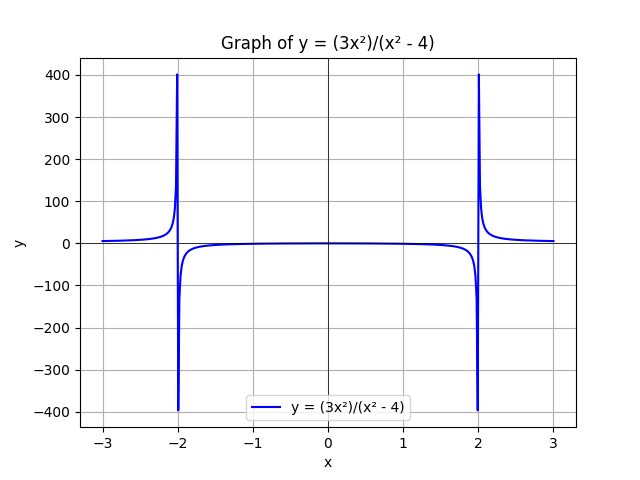

# Introduction to Calculus with Python
## 1. Limits
In this series, we examine the behaviour of a graph in relation to an increase or decrease in the input of our function.

The following equation cannot allow for x to take 2, as our function becomes undefined.

### $y= \frac {3(x-2)} {x-2}$
<br> The equation can be used to examine the behaviour of the graph as x approaches 2. 
We can also model this with python code as follows.

```python
x=2
h= 0.00001
y_right= (3*((x+h)-2)/((x+h) -2))
y_left=(3*((x-h)-2))/((x-h)-2)

print("y_right: ",y_right)
print("y_left: ",y_left)

if round(y_right) != round(y_left):
    print("Limit does not exist at x=",x)
```
As x approaches 2, the value of our function approaches 3. Also, the if the limit as x approaches 2 from the right is not
equal to the limit as x approaches 2 from the left, then the limit does not exist at that point.

## 2. Assymptotes and Limits
A `mathematical asymptote` is a line that a curve approaches but never actually touches or crosses, as the input (usually 
𝑥) goes to infinity, negative infinity, or a specific value. <br>
Take a look at the equation below.<br>

###  $f(x)=\frac{3x^2}{x^2 - 4}$ 
As x approaches 2 from the right, the value of y becomes larger and larger. As x approaches 2 from the left, the value of 2 
becomes smaller and smaller.<br>

```python
x2=2
h=0.0001
y_right=(3*(x2+h)**2)/((x2+h)**2-4)
y_left=(3*(x2-h)**2)/((x2-h)**2-4)
print("y_right: ",y_right)
print("y_left: ",y_left)

if round(y_right)!=round(y_left):
    print("Limit does not exist at x2=",x2)
```

## 📘 Solving an Equation Using SymPy in Python

This example demonstrates how to solve the quadratic equation:

$$
x^2 - 4 = 0
$$

using the `sympy` library in Python.

---

### ✅ Step-by-Step Code

```python
# Import required components from sympy
from sympy import symbols
from sympy.solvers import solve

# Define x as a symbolic variable
x = symbols('x')

# Define the equation x² - 4
eq = x**2 - 4

# Solve the equation for x
solutions = solve(eq, x)

# Print the solutions
print("x = ", solutions)
```

---

### 🧠 Explanation

* `symbols('x')`: Declares `x` as a symbolic variable, meaning that it informs python to treat it as humans do in algebra.
* `x**2 - 4`: This defines the left-hand side of the equation $x^2 - 4 = 0$.
* `solve(eq, x)`: Finds the values of `x` that satisfy the equation.
* `print(...)`: Displays the result.

---

### 📟 Output

The result of running this code will be:

```
x =  [-2, 2]
```

These are the two roots of the equation $x^2 - 4 = 0$.

---
